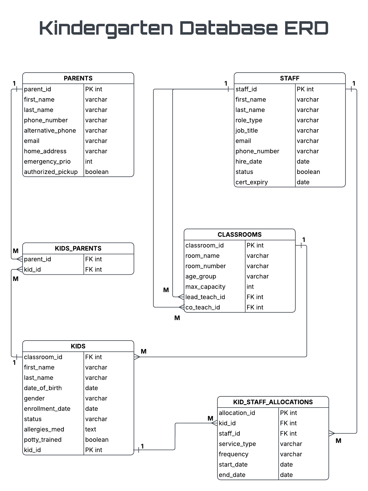

# Kindergarten Database

A PostgreSQL database project designed to manage children, parents, staff, classrooms, and staff allocations in a kindergarten environment.

The project demonstrates relational database design, table relationships, constraints, sample data population, and basic schema evolution.

## Entity Relationship Diagram

The ERD represents the original database design.

## Project Files

| File | Description |
|---|---|
| `schema.sql` | Creates the database tables, relationships, and constraints |
| `seed.sql` | Populates the database with sample data |
| `migrations.sql` | Contains schema modifications performed after the initial database was created |
| `kindergarten_db_ERD.png` | Visual representation of the original database design |

## Usage

For the original database setup:

1. Run `schema.sql`
2. Run `seed.sql`

### Migrations

`migrations.sql` contains additional database manipulations performed after the original schema and sample data were created. It demonstrates changes made to the database structure over time.

The ERD represents the database before these migration changes.

## Tools & Concepts

- PostgreSQL
- DataGrip
- SQL
- Relational database design
- Primary and foreign keys
- One-to-many and many-to-many relationships
- Constraints
- Data seeding
- Schema migrations
